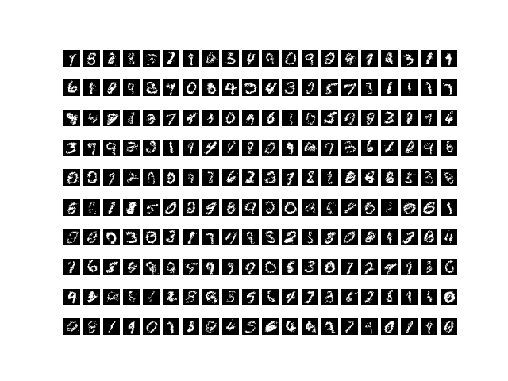

# VAE
Implementation of Variational Autoencoder in PyTorch

[Paper](https://arxiv.org/pdf/1804.00347.pdf)

[App](https://alexanderamy-vae-st-main-5hq40u.streamlit.app/)

## Setup
1. `conda create -n vae python=3.8`
2. `conda activate vae` 
3. `pip install -r requirements.txt`

## Run
Train: `python run_vae.py`

Generate MNIST digits: `python run_vae.py --train 0`

## Results

